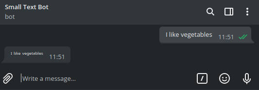

<h1 align="center">telegram small text bot</h1>

<p align="center">
This is a simple telegram bot for making your message font small
You can test it here: <a href="https://t.me/smallText_bot">@smallText_bot</a>
</p>

***
<h3 align="center">Usage</h3>

<p align="center">
  Just send a message to my bot and it will reply with your message but with <i>cool</i> little letters.<br>
Now you can copy it and send it to your friends<br><br>

</p>

***
<h3 align="center">Installation</h3>

```
* git clone https://github.com/JonaszPotoniec/telegramSmallTextBot.git
* npm install  
* <insert your bot token into confing.json>  
* npm start  
```
***
<h3 align="center">Settings</h3>

<h4 align="center">Settings are stored in config.json</h4>


|setting      | description |
|-------------|-------------|
| `remove_unknown`       | This defines if characters that can't be converted should be deleted |
| `token`     | This is your bot token. It's required and can be easily obtained from [Bot Father](https://telegram.me/BotFather)|


